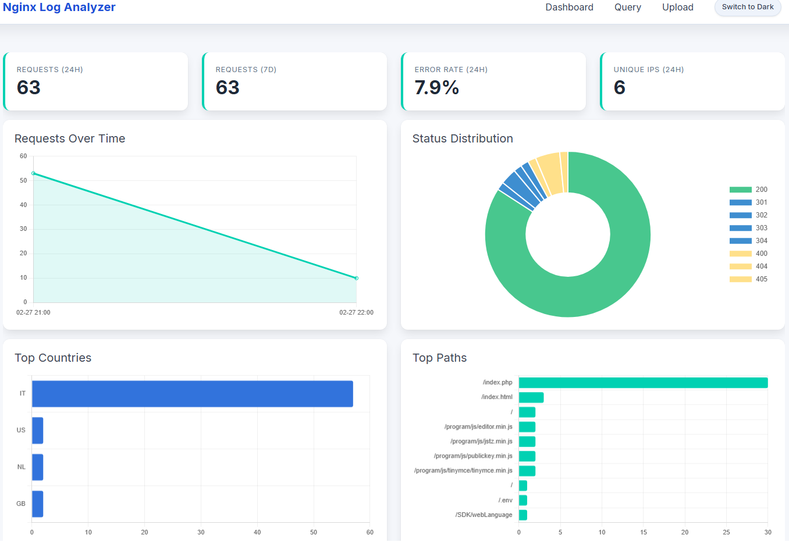
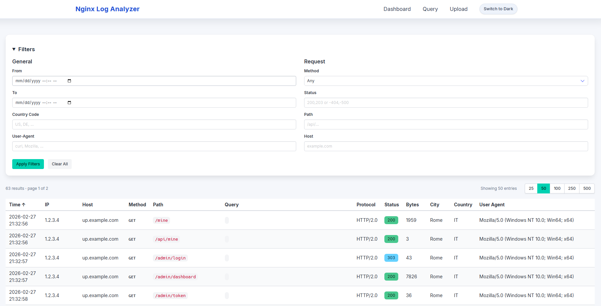
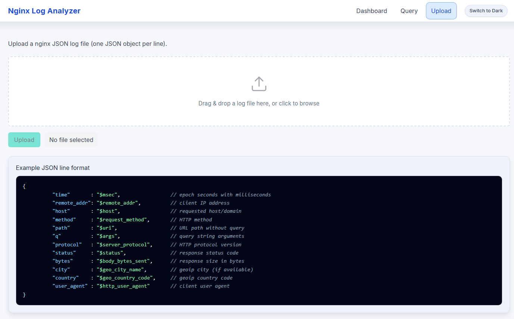

# nginx-log-analyzer

A lightweight, self-hosted web dashboard for analyzing nginx JSON access logs. Built with Go and SQLite -- no external database required.

## Features

- **Dashboard** -- 24h/7d request totals, error rate, unique IPs, and charts for traffic over time, status distribution, top countries, and top paths.
- **Query page** -- filterable, sortable, paginated log viewer with support for include/exclude filters (e.g. `200,203` or `-404,-500`).
- **File upload** -- upload JSON log files via the web UI. Duplicate entries are automatically skipped.
- **Live tailing** -- optionally point at a local nginx log file and ingest new entries in real time.
- **Configurable ingestion filters** -- skip requests by IP, extension, method, status code, or path prefix.
- **Automatic retention** -- old entries are purged based on `retention_days`.

## Quick Start

```bash
# Build
go build -o server ./cmd/server

# Run (uses config.yaml in the current directory)
./server
```

Open `http://localhost:8080`.

## Configuration

All options are in `config.yaml`:

```yaml
log_path: ""           # path to nginx JSON log file (empty = disable live tailing)
db_path: "./data/access.db"
retention_days: 30
listen: ":8080"
upload_enabled: true   # enable/disable the /upload endpoint
page_size: 50          # default rows per page
ignore:
  whitelisted_ips: []
  skip_extensions: []
  skip_methods: []
  skip_status_codes: []
  skip_path_prefixes: []
```

`upload_enabled` can be overridden with the `UPLOAD_ENABLED` environment variable.

## Nginx Log Format

Configure nginx to output JSON logs:

```nginx
log_format json_logs escape=json
  '{'
    '"time":"$msec",'
    '"remote_addr":"$remote_addr",'
    '"host":"$host",'
    '"method":"$request_method",'
    '"path":"$uri",'
    '"q":"$args",'
    '"protocol":"$server_protocol",'
    '"status":"$status",'
    '"bytes":"$body_bytes_sent",'
    '"city":"$geo_city_name",'
    '"country":"$geo_country_code",'
    '"user_agent":"$http_user_agent"'
  '}';

access_log /var/log/nginx/access.json json_logs;
```


## Preview

Dashboard



Query



Upload

